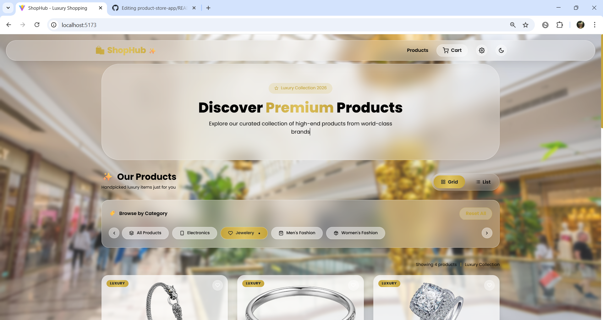
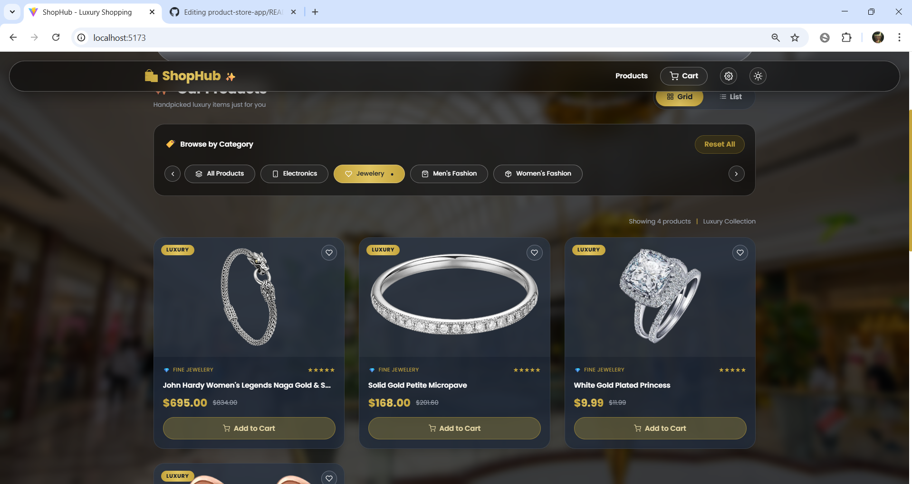
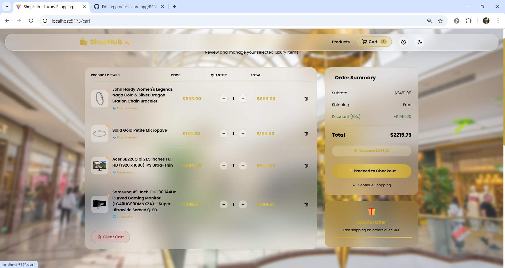
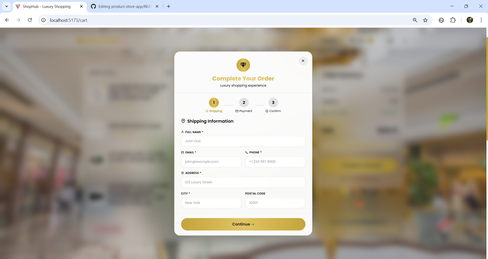
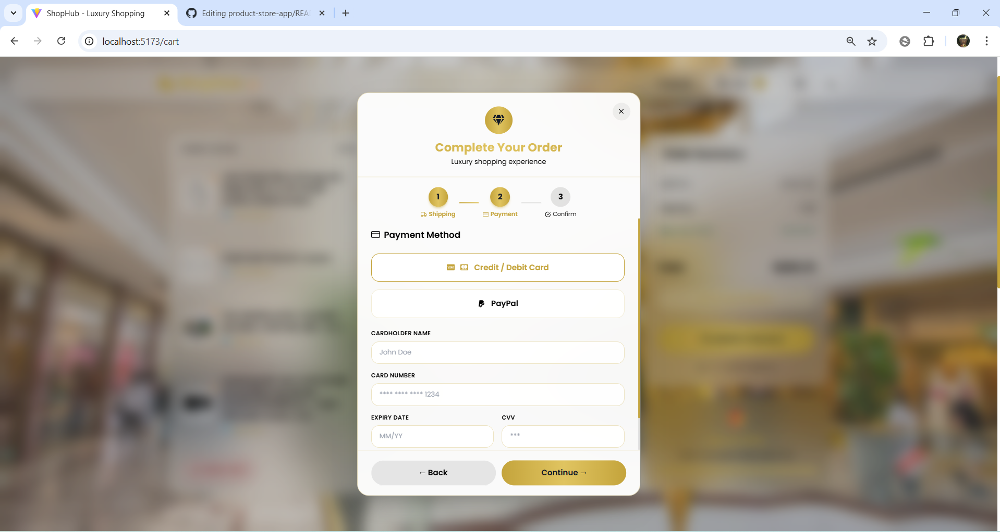
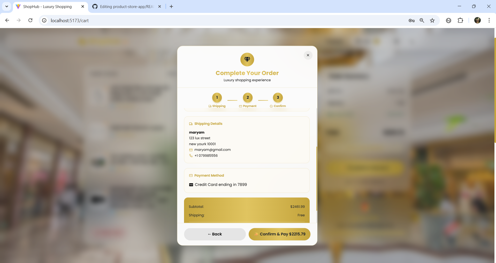
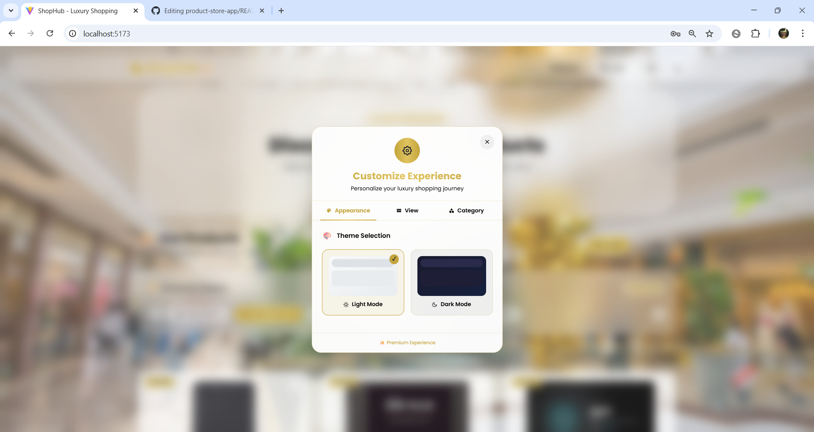
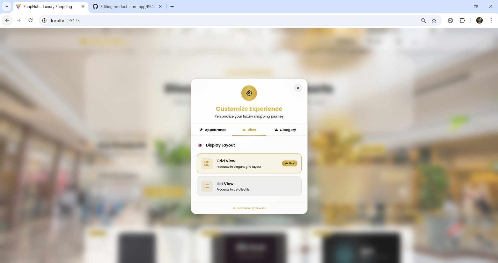

# 🛍️ Product Store App

<div align="center">


**A complete product store application demonstrating Context API, Redux Toolkit, and React Query**

[Live Demo](https://n-rahimi.github.io/product-store-app/) 

</div>

---

## 📋 Project Overview

This project is a **Product Store Application** built as part of the Week 7, 8, and 9 assignment. It demonstrates the practical use of three different state management approaches in React:

| State Management Tool        | Purpose                                                        |
| ---------------------------- | -------------------------------------------------------------- |
| **Context API + useReducer** | App settings (theme, view mode, category filter)               |
| **Redux Toolkit**            | Shopping cart state (add, remove, quantity, total)             |
| **React Query**              | Server state (product fetching, caching, loading/error states) |

---

## ✨ Features

### Core Features (Required)

| Feature             | Status    | Description                                 |
| ------------------- | --------- | ------------------------------------------- |
| ✅ Product Listing  | Completed | Products fetched from FakeStoreAPI          |
| ✅ Loading State    | Completed | Skeleton loader while fetching data         |
| ✅ Error State      | Completed | Error message with retry button             |
| ✅ Cart Management  | Completed | Add, remove, increase, decrease, clear cart |
| ✅ Cart Persistence | Completed | Saves cart to localStorage                  |
| ✅ Theme Switching  | Completed | Light/Dark mode with class-based styling    |
| ✅ View Mode        | Completed | Grid/List view toggle                       |
| ✅ Category Filter  | Completed | Filter products by category                 |

### Bonus Features

| Feature                     | Status       |
| --------------------------- | ------------ |
| 🎨 Glassmorphism Design     | ✅ Completed |
| 📱 Fully Responsive         | ✅ Completed |
| 🔔 Toast Notifications      | ✅ Completed |
| 💾 localStorage Persistence | ✅ Completed |
| ⚡ Skeleton Loading         | ✅ Completed |
| 🛒 Checkout Modal           | ✅ Completed |
| 📄 Product Details Page     | ✅ Completed |

---

## 🛠️ Technologies Used

### Core Libraries

````json
{
  "react": "^19.2.5",
  "react-dom": "^19.2.5",
  "react-redux": "^9.2.0",
  "@reduxjs/toolkit": "^2.11.2",
  "@tanstack/react-query": "^5.100.1",
  "axios": "^1.15.2",
  "react-router-dom": "^7.14.2"
}
Styling & UI
json
{
  "tailwindcss": "^3.4.17",
  "react-icons": "^5.6.0",
  "react-hot-toast": "^2.6.0"
}
Build Tool
json
{
  "vite": "^8.0.10"
}

 ###  📁 Project Structure
text
product-store-app/
├── src/
│   ├── api/
│   │   └── productsApi.js              # Axios API calls
│   │
│   ├── components/
│   │   ├── layout/
│   │   │   └── MainLayout.jsx          # Layout wrapper
│   │   ├── CategoryFilter.jsx          # Category filter component
│   │   ├── CheckoutModal.jsx           # Checkout modal (3 steps)
│   │   ├── Footer.jsx                  # Footer component
│   │   ├── Navbar.jsx                  # Navigation bar
│   │   ├── ProductCard.jsx             # Product card (grid/list view)
│   │   └── ProductList.jsx             # Product list with loading/error
│   │
│   ├── context/
│   │   └── AppSettingsContext.jsx      # Context + useReducer for settings
│   │
│   ├── pages/
│   │   ├── CartPage.jsx                # Shopping cart page
│   │   ├── HomePage.jsx                # Home page with hero section
│   │   └── ProductDetailsPage.jsx      # Product details page
│   │
│   ├── redux/
│   │   ├── cartSlice.js                # Redux Toolkit slice for cart
│   │   └── store.js                    # Redux store configuration
│   │
│   ├── App.jsx                         # Main app with routes
│   ├── index.css                       # Global styles + Tailwind
│   ├── main.jsx                        # Entry point
│   │
├── public/
├── index.html
├── package.json
├── tailwind.config.js                  # Tailwind configuration
├── postcss.config.js                   # PostCSS configuration
├── vite.config.js                      # Vite configuration
└── README.md                           # Project documentation

# 🧠 State Management Implementation

1. Context API + useReducer (App Settings)
File: src/context/AppSettingsContext.jsx

Managed State:

Theme (light / dark)

View Mode (grid / list)

Selected Category

Actions:

javascript
setTheme('light' | 'dark')
setViewMode('grid' | 'list')
setCategory(categoryId)
Features:

Persists to localStorage

Global access via useAppSettings() hook

No prop drilling

2. Redux Toolkit (Shopping Cart)
File: src/redux/cartSlice.js

State Structure:

javascript
{
  items: [],           // Array of cart items
  totalQuantity: 0,    // Total number of items
  totalAmount: 0       // Total price
}
Actions:

javascript
addItem(product)           // Add product to cart
removeItem(productId)      // Remove product from cart
increaseQuantity(productId) // Increase quantity by 1
decreaseQuantity(productId) // Decrease quantity by 1
clearCart()                 // Clear entire cart
Features:

Persists to localStorage

Real-time total calculation

Toast notifications on actions

3. React Query (Server State)
File: src/api/productsApi.js

Queries:

javascript
useQuery({
  queryKey: ['products'],
  queryFn: productsApi.getAllProducts
})

useQuery({
  queryKey: ['product', id],
  queryFn: () => productsApi.getProductById(id)
})

useQuery({
  queryKey: ['categories'],
  queryFn: productsApi.getCategories
})
Features:

Automatic caching

Background refetching

Loading and error states

Stale time configuration (5 minutes)

🚀 Installation & Setup
Prerequisites
Node.js (v18 or higher)

npm or yarn

Step 1: Clone the Repository
bash
git clone https://github.com/N-rahimi/product-store-app.git
cd product-store-app
Step 2: Install Dependencies
bash
npm install
Step 3: Install Tailwind CSS
bash
npm install -D tailwindcss postcss autoprefixer
npx tailwindcss init -p
Step 4: Run the Development Server
bash
npm run dev
Step 5: Build for Production
bash
npm run build
npm run preview

 # 🌐 API Integration
This project uses the FakeStoreAPI for product data.

Endpoint	Method	Description
https://fakestoreapi.com/products	GET	Get all products
https://fakestoreapi.com/products/{id}	GET	Get single product
https://fakestoreapi.com/products/categories	GET	Get all categories
https://fakestoreapi.com/products/category/{category}	GET	Get products by category

📱 Responsive Breakpoints

Device	Screen Width	Columns
Mobile	< 640px	1 column
Tablet	640px - 1024px	2 columns
Desktop	> 1024px	3 columns

🎨 Color Palette

Color	Hex Code	Usage
Gold	#c4a43c	Primary brand color, gradients
Ruby	#9b2c2c	Delete buttons, errors
Emerald	#2d6a4f	Discounts, success messages
Light Text	#2c1810	Light mode text
Dark Text	#f5e6d3	Dark mode text

📷 Screenshots

### PRODUCT Page


### 🛍 Product Page


### 🛒 Cart Page


### 💳 Checkout Page
 
 
 

### ⚙️ Settings Page
 
 
 


✅ Assignment Requirements Checklist

Requirement	Status	Location
Context API + useReducer	✅	context/AppSettingsContext.jsx
At least 2 settings (theme, view mode)	✅	Theme + View Mode + Category
Redux Toolkit for cart	✅	redux/cartSlice.js
Add, remove, quantity, clear cart	✅	Cart page + Redux actions
React Query for products	✅	api/productsApi.js
Loading state	✅	ProductList.jsx skeleton
Error state	✅	ProductList.jsx error message
Product details page	✅	ProductDetailsPage.jsx
Clean code structure	✅	Modular components
README file	✅	This file

🤝 How These Technologies Work Together
text
┌─────────────────────────────────────────────────────────────┐
│                      React Application                       │
├─────────────────────────────────────────────────────────────┤
│                                                              │
│  ┌──────────────────┐    ┌──────────────────┐              │
│  │  Context API +   │    │   Redux Toolkit  │              │
│  │    useReducer    │    │    (Cart State)  │              │
│  │  (App Settings)  │    │                  │              │
│  │                  │    │ • items          │              │
│  │ • theme          │    │ • quantity       │              │
│  │ • viewMode       │    │ • total amount   │              │
│  │ • category       │    │                  │              │
│  └────────┬─────────┘    └────────┬─────────┘              │
│           │                       │                         │
│           ▼                       ▼                         │
│  ┌──────────────────────────────────────────────┐          │
│  │              React Query                      │          │
│  │           (Server State)                      │          │
│  │                                               │          │
│  │  • products data from API                     │          │
│  │  • caching & background refetching            │          │
│  │  • loading / error states                     │          │
│  └──────────────────────────────────────────────┘          │
│                                                              │
└─────────────────────────────────────────────────────────────┘
📚 Learning Outcomes
By completing this project, I have demonstrated:

Context API + useReducer: Managing app-wide settings without prop drilling

Redux Toolkit: Handling complex cart state with predictable updates

React Query: Efficient server state management with automatic caching

Separation of Concerns: Different tools for different types of state

Modern React Patterns: Functional components, hooks, custom hooks

📝 Future Improvements
Add user authentication

Add product search functionality

Add price sort (low to high / high to low)

Add product reviews with mutations

Add wishlist feature

Add order history page

👨‍💻 Author

Nadima Rahimi - GitHub

🙏 Acknowledgments
FakeStoreAPI for providing the product API

Tailwind CSS for the utility-first CSS framework

React Icons for the icon set

<div align="center">
⭐ If you found this project helpful, please give it a star!

</div> ```
````
